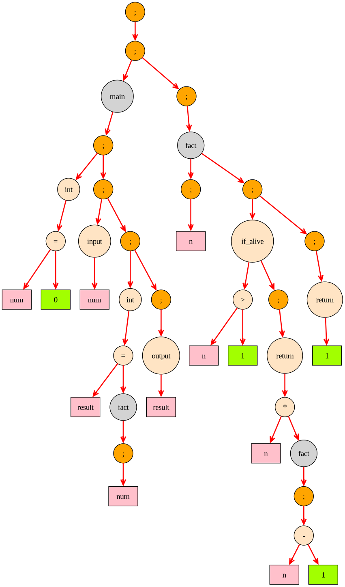
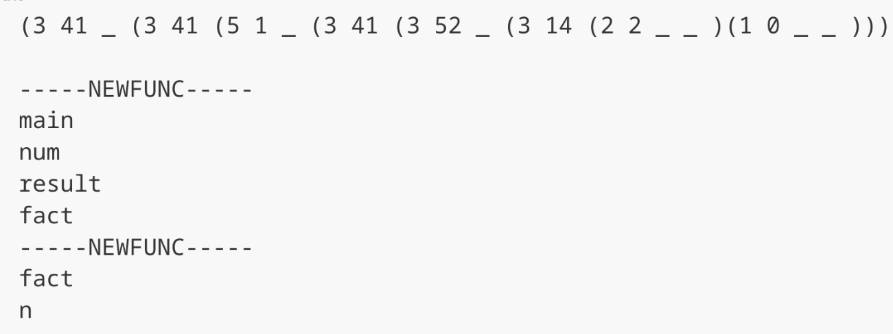
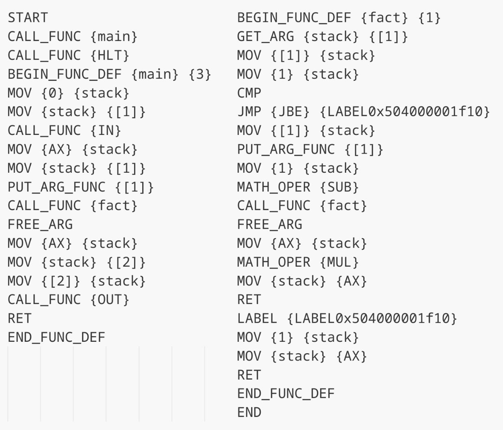
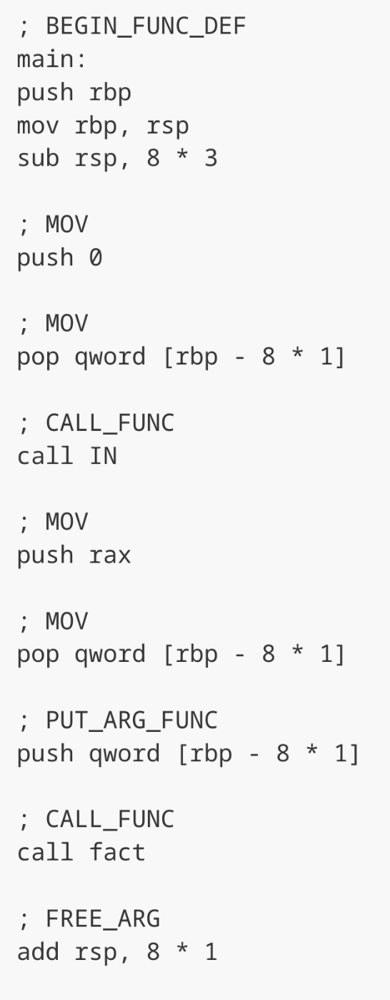
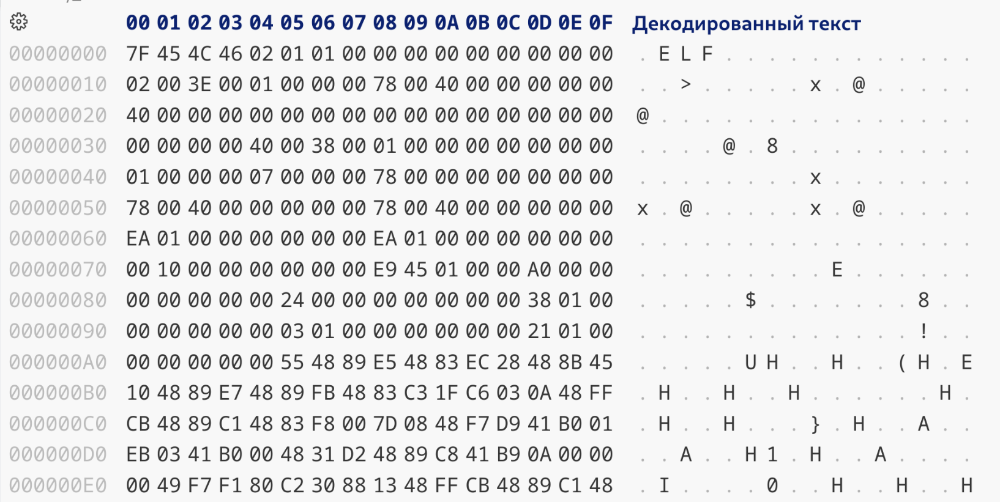
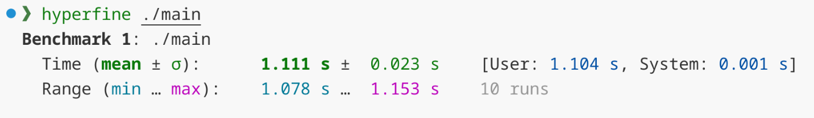
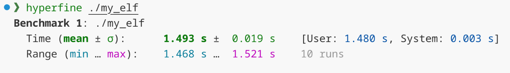
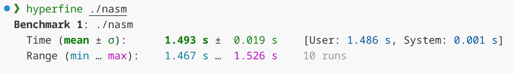
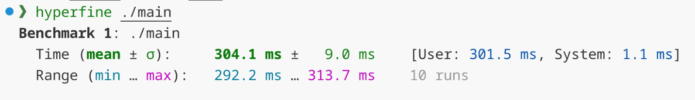

# Language

## Пример компиляции программы.

### Исходный код

```
main ()
udos
    int num = 0;
    input (num);
    int result = fact (num);
    output (result);
peresda

fact (n)
udos
    if_alive (n > 1)
    udos
        return n * fact (n - 1);
    peresda

    return 1;
peresda
```

### Абстрактное синтаксическое дерево


Рис. 1. Абстрактное синтаксическое дерево.

### Текстовый формат абстрактного синтаксического дерева


Рис. 2. Текстовый формат абстрактного синтаксического дерева.

### Промежуточное представление


Рис. 3. Промежуточное представление.

### Трансляция в NASM


Рис. 4. Ассемблерный код.

### Трансляция в Elf64


Рис. 5. Исполняемый файл.

## Сравнение с компилятором gcc

Программа, на которой проводились сравнения. (Без использования функций printf, scanf, для более точного измерения).

```
main () 
udos
    int num = 40;
    int result = fib (num); 
peresda

fib (n) 
udos
    if_alive (n == 0)
    udos
        return 0;
    peresda

    dead 
    udos 
        if_alive (n == 1)
        udos
            return 1;
        peresda
        
        dead
        udos
            int c = fib (n - 1);
            int d = fib (n - 2);
            return c + d;
        peresda
    peresda
peresda

```

| | Время, с |
| :-: | :-: |
|gcc -O0| 1,111 |
|my_elf|  1,493 |
|nasm | 1,493 |
|gcc -O3| 0,304 |



Рис. 6. gcc с флагом -O0.



Рис. 7. Исполняемый файл.



Рис. 8. Ассемблерный файл.



Рис. 9. gcc с флагом -O3.

<details>
<summary>.</summary>
Project of translation system - from my language to assembler 

> [!Important]
> The project has a submodule [```Processor```](https://github.com/bstrsanya/Processor) that compiles the assembly code and runs the program.

## Grammar

```cpp
Tokens
    TName   ::= token_name
    TNumber ::= token_number

Main Rules
    G ::= M END
    M ::= {D}*
    D ::= TName '(){' {S}* '}'
    S ::= {V ';'}*
    V ::= I | W | F | A

Structural analysis
    I ::= 'if(' C '){' S '}' [['else{' S '}']]
    W ::= 'while(' C '){' S '}'
    F ::= TName '(' [[E]] { ',' E}* ')'
    A ::= ([['int' | 'double']] TName '=') F | C

Expression analysis
    C ::= E{['==' '<' '>' '<=' '>=' '!=']E}*
    E ::= T{[+-]T}*
    T ::= P{[*/]P}*
    P ::= '('E')' | N
    N ::= TName | TNumber
```

## Compare C & My language

*Example of code (C):*

```cpp
int main ()
{
    int factorial = 1;
    int counter = 1;
    int value = 0;
    scanf ("%d", &value);
    fact ();
    printf ("%d", factorial);
}

void fact ()
{
    while (counter <= value)
    {
        factorial = factorial * counter;
        counter = counter + 1;
    }
}
```

*Example of code (My language):*

```cpp
main () 
udos
    int factorial = 1;
    int counter = 1;
    int value = 0;
    input (value);
    fact (); 
    output (factorial);
peresda

fact () 
udos
    when_good (counter <= value) 
    udos
        factorial = factorial * counter;
        counter = counter + 1;
    peresda
peresda
```
</details>